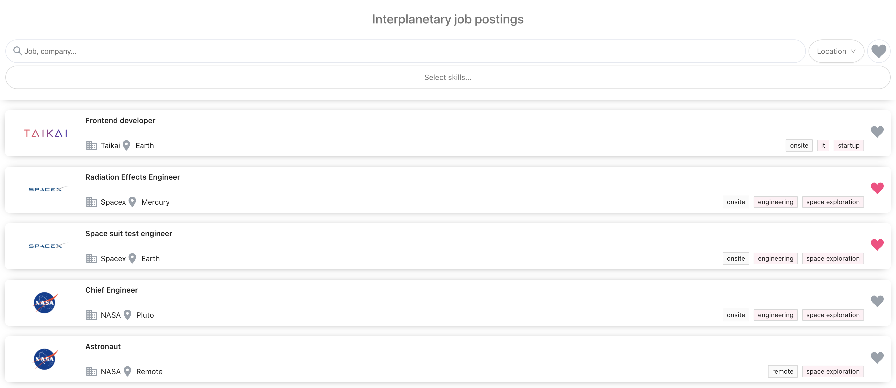
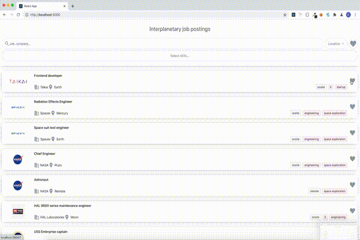

## Overview

The main objective of the task was to create a frontend job board application with UX in mind.
The solution provides 4 types of filtering of job offers:

- filtering by text provided by the user searching among job title names and company names
- filtering by location (single select)
- filtering by favorite (filters jobs marked as favorite - the information about favorite job offers is stored in `local storage` so they outlive the page refresh)
- filtering by skills (multiselect filtering all job offers with any of the selected skills)



## Screencast



## Installation and running

To install dependencies run

```bash
yarn install
```

To start the development build:

```bash
yarn start
```

The UI will be available at `http://localhost:3000`

To start the production build:

```bash
yarn build
npx serve build
```

The UI will be available at `http://localhost:5000`

## Tech stack

This project was bootstrapped with [Create React App](https://github.com/facebook/create-react-app) with Typescript.
Styling was based on scoped, modular scss.
A few components from the `Ant Design` design system were also used.
Certain business logic was based on `ramda` and `react router`.

## Implementation details

Job postings filtering was implemented using:

- `useState` hook for the component's local state of job offers (`jobOffers`) + local state of the flags that allow filtering
- `useEffect` hook triggered on each value change of any variables provided in the hook's dependancy array
- `ramda`'s `compose` function

```javascript
//...
compose(
  filterBySearchTermFunction,
  filterByFavoriteFunction,
  filterByLocationFunction,
  filterBySkillsFunction
  // any other function with a signature (filterData: Filter): Filter may be passed to filter the results
)({
  // object satissfying Filter interface
});
```

The FP-based approach allows quick additions of any necessary filter functions.

The details are available in the `src/components/job-board/job-board.tsx` file.

## Afterword

Thank you for the opportunity and your time
